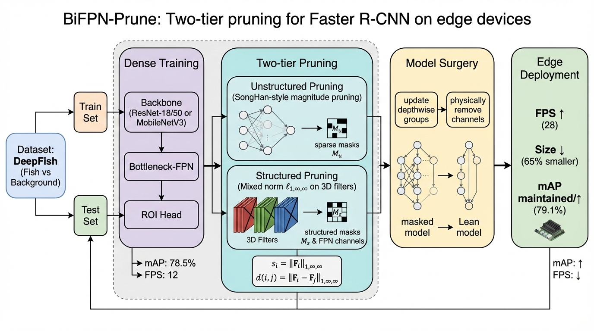

# :fish: Fish object detection with BiFPN

<div align="center">

[](https://github.com/barone04/PrunedFishNet)
[](https://www.python.org/downloads/release/python-3100/)
[](https://pytorch.org/)
[](https://opensource.org/licenses/MIT)

</div>

---

<div align="center">

<a href="https://github.com/barone04">Phan Dinh Thai Bao</a><sup>1</sup>,
<a href="https://github.com/nWoWolfpac">Ha Vu Minh Duc</a><sup>1</sup>,
<a href="https://github.com/duyh80456-code">Tran Duy Hung</a><sup>2</sup>,
<a href="https://scholar.google.com/citations?user=PXS0BHMAAAAJ&hl">Le Xuan Hai</a><sup>3</sup>,
<a href="http://tpnguyen.univ-tln.fr/">Nguyen Thanh Phuong</a><sup>4</sup> &#x2709;

</div>


<div align="center">

<div style="font-size: 0.95em; line-height: 1.4;">

<sup>1</sup> VNU University of Science, Hanoi, Vietnam  
<sup>2</sup> VNU University of Engineering and Technology, Hanoi, Vietnam  
<sup>3</sup> VNU International School, Hanoi, Vietnam  
<sup>4</sup> University of Côte d’Azur, I3S, CNRS, UMR 7271, Sophia Antipolis, France  

✉ <em>Corresponding Author</em>

</div>

</div>

---


We present a two-level pruning framework that combines iteratively magnitude-based unstructured sparsification with mixednorm structured filter pruning to accelerate Faster R-CNN and reduce model size for online underwater fish detection. Unlike prior work that mainly compresses the backbone, our method also prunes the Feature Pyramid Network (FPN), which becomes a major bottleneck once the backbone is lightweight. Experiments on DeepFish with ResNet-18/50 and MobileNetV3 backbones show that FPN-aware pruning yields larger throughput and storage gains while preserving detection accuracy, and in several settings improves mAP@0.5–0.95 after re-optimization. The resulting compact models provide a practical recipe for accurate edge deployment in underwater
object detection.




**Fig. 1 — Proposed Bottleneck-FPN architecture.** The standard 3×3 smoothing convolution is replaced by a **1×1 compress – depthwise 3×3 – 1×1 expand** block, so pruning the inner width directly reduces neck cost.

*Proposed framework and system overview (see Fig. 1).*

# :star2: News

Project is under active development :construction_worker:. Please stay tuned for updates.

- **Now:** Quantitative **efficiency** comparison on **DeepFish** at **800×800** is in [TABLE I](#table-i-efficiency-comparison-of-dense-and-pruned-detectors) below; qualitative GIFs are in [Main results](#dart-main-results) and [Supplementary materials](#art-supplementary-materials).
- **Checkpoints:** Weights (pruned backbone / FPN variants) are available in this Google Drive folder: [checkpoints](https://drive.google.com/drive/folders/11fkMXem0lGd0KF1R9Cn9VzJtgIvL_xU0?usp=sharing) (`prune_bb_besnet18`, `prune_bb_resnet50`, `prune_fpn_mobilenetv3`, `prune_fpn_resnet18`).

# :dart: Main results

<a name="dart-main-results"></a>


We evaluate on **DeepFish**: dense vs. pruned detectors (Params, FLOPs, FPS). **TABLE I** summarizes efficiency; animated previews below illustrate detection behavior. Regenerate metrics locally with `benchmark.py`, `train_det.py --test-only`, and `compare_acc.py` if needed.


<a name="table-i-efficiency-comparison-of-dense-and-pruned-detectors"></a>

### TABLE I: Efficiency comparison of dense and pruned detectors


*Setting: **DeepFish**.*


| Setting | Params (M) | Δ (%) | FLOPs (G) | Δ (%) | FPS | Δ (%) |
|--------|-------------|------|------------|------|------|------|
| MobileNetV3 (FPN prune) | `7.68 → 7.41` | -3.50 | `45.69 → 42.09` | -7.87 | `0.88 → 0.84` | -4.19 |
| ResNet-18 (B+FPN prune) | `26.46 → 20.69` | -21.82 | `77.28 → 61.92` | -19.87 | `0.42 → 0.50` | +21.10 |
| ResNet-18 (B only prune) | `28.28 → 22.78` | -19.47 | `101.36 → 89.61` | -11.60 | `0.76 → 0.76` | +1.05 |
| ResNet-50 (B only prune) | `41.35 → 25.35` | -38.70 | `134.49 → 90.71` | -32.56 | `0.56 → 0.86` | +55.00 |


*Δ is the relative change from **dense → pruned** (%). FPS measured under the same hardware/protocol as in the paper.*

### Qualitative detection — inline previews

| ResNet-18 + FPN (baseline) | ResNet-18 + pruned backbone |
|----------------------------|-----------------------------|
|  |  |

| ResNet-50 + pruned backbone | MobileNetV3 |
|----------------------------|-------------|
|  |  |

# :wrench: Installation

```bash
pip install -r requirements.txt
```

Core dependencies include PyTorch, torchvision, OpenCV, pycocotools, SciPy, Matplotlib, and thop (see `requirements.txt`).

# :octocat: Reproducibility — Pipeline 2 (end-to-end)

<a name="pipeline-2-end-to-end"></a>

The reference automation is **`scripts/pipeline2_end2end.sh`**. It runs three stages on **DeepFish-style** detection data in YOLO layout ([dataset paths](#dataset-layout)).

### Run the full script (Linux / Git Bash / WSL)

From the repository root:

```bash
bash scripts/pipeline2_end2end.sh
```

Edit the **configuration block** at the top of the script if needed:

| Variable | Default in script | Role |
|----------|-------------------|------|
| `DATA_ROOT` | `./NewEtroplusMaculatus` | Root folder with `images/{train,val}` and `labels/{train,val}` |
| `OUTPUT_ROOT` | `./output/pipeline2` | All intermediate and final checkpoints |
| `BATCH_SIZE` | `8` | Training / pruning batch size |
| `WORKERS` | `16` | `DataLoader` workers |
| `MODEL` | `mobilenet_v3` | Passed to `train_det.py` / `prune_det.py` (`mobilenet_v3`, `resnet18`, `resnet50`, `fasterrcnn_resnet18_fpn`. depending on your CLI) |

### Step 1 — Train dense Faster R-CNN

```bash
python train_det.py \
  --data-path ./NewEtroplusMaculatus \
  --model mobilenet_v3 \
  --epochs 60 \
  --batch-size 8 \
  --workers 16 \
  --lr 0.01 \
  --box-head-dim 256 \
  --min-size 320 \
  --max-size 320 \
  --output-dir ./output/pipeline2/step1_dense_det
```

**Output:** `./output/pipeline2/step1_dense_det/model_best.pth`

### Step 2 — Iterative detection pruning (SongHan + filter; optional FPN)

```bash
python prune_det.py \
  --data-path ./NewEtroplusMaculatus \
  --model mobilenet_v3 \
  --checkpoint ./output/pipeline2/step1_dense_det/model_best.pth \
  --target-sparsity 0.5 \
  --prune-iters 8 \
  --finetune-epochs 10 \
  --batch-size 8 \
  --output-dir ./output/pipeline2/step2_pruned_det \
  --box-head-dim 256 \
  --min-size 320 \
  --max-size 320 \
  --prune-fpn
```

- **`--prune-fpn`:** prunes the FPN / neck path; remove this flag if you only want backbone-oriented pruning (matches experiments without FPN pruning).
- Tune `--target-sparsity`, `--prune-iters`, and `--finetune-epochs` for your backbone.

**Outputs:** `./output/pipeline2/step2_pruned_det/model_lean.pth`, `./output/pipeline2/step2_pruned_det/model_lean.json`

### Step 3 — Final finetune with lean weights + JSON channel config

```bash
python train_det.py \
  --data-path ./NewEtroplusMaculatus \
  --model mobilenet_v3 \
  --weights-backbone ./output/pipeline2/step2_pruned_det/model_lean.pth \
  --compress-rate ./output/pipeline2/step2_pruned_det/model_lean.json \
  --epochs 50 \
  --batch-size 8 \
  --workers 16 \
  --lr 0.02 \
  --lr-steps 100 130 \
  --box-head-dim 256 \
  --min-size 320 \
  --max-size 320 \
  --output-dir ./output/pipeline2/step3_final_result
```

**Output:** `./output/pipeline2/step3_final_result/model_best.pth`

# :unlock: Checkpoints

**Pretrained checkpoints.** To reproduce or fine-tune without training from scratch, download artifacts from Google Drive: [checkpoints folder](https://drive.google.com/drive/folders/11fkMXem0lGd0KF1R9Cn9VzJtgIvL_xU0?usp=sharing). The bundle includes subfolders for backbone-only pruning (`prune_bb_besnet18`, `prune_bb_resnet50`) and FPN-focused setups (`prune_fpn_mobilenetv3`, `prune_fpn_resnet18`). Point `--weights` / `--weights-backbone` / `--compress-rate` at the matching `.pth` / `.json` files for your `--model`, following the layout in each folder.

# :email: Contact
 We hope that the new perspective of BiFPN and its template may inspire more developments :rocket: on network compression.

We warmly welcome your participation in our project!

To contact us, never hesitate to contact [baopdt04@gmail.com](mailto:baopdt04@gmail.com).
<br></br>